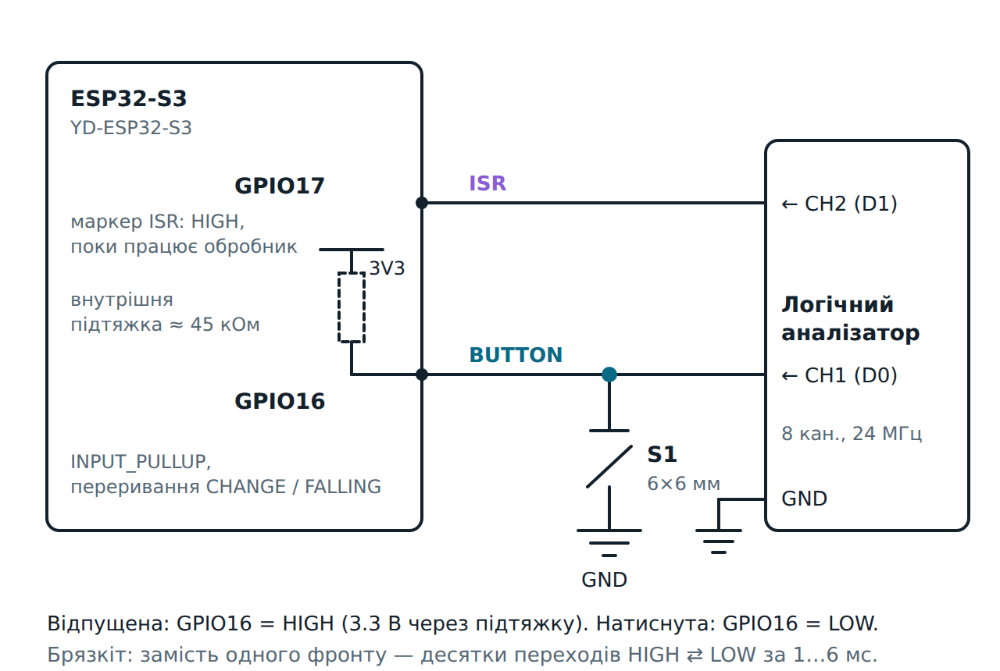

# ESP32-S3: брязкіт кнопки — логічний аналізатор проти переривань

Модуль 1.5, домашнє завдання. Кнопка на GPIO16 замикає вивід на GND. Логічний аналізатор записує
на тому самому піні **усі** перемикання (це «правда»). ESP32-S3 рахує, що встиг помітити через
апаратне переривання. Порівнюємо обидві картини і з'ясовуємо, коли мікроконтролер пропускає
імпульси, коли рахує зайве і яка затримка debounce потрібна саме вашій кнопці.

Плата — **YD-ESP32-S3** (VCC-GND Studio, клон ESP32-S3-DevKitC-1, N16R8).

Дві прошивки в одному проєкті:

| Середовище (`-e`) | Файл                    | Що робить |
|-------------------|-------------------------|-----------|
| `homework-base`   | `src/homework_base.cpp` | код з умови без змін: переривання `FALLING`, друкує `Button Pressed! Count: N` |
| `bounce-lab` (типове) | `src/main.cpp`      | переривання `CHANGE`: кожен фронт із часом у мкс, звіт на кожне натискання/відпускання, підсумок на 10 натискань, маркер ISR на GPIO17 |

```bash
cd esp32-s3-button-bounce
pio run -e homework-base -t upload && pio device monitor   # код з умови
pio run -t upload && pio device monitor                     # лабораторна прошивка; s = підсумок, r = скинути
python3 tools/vcd_bounce.py capture.vcd --button D0 --isr D1   # звіт із запису аналізатора
```

### Інтерактивні сторінки та симуляція

| Де | Як |
|----|----|
| [**Осцилограф і кнопка**](https://grok-rs.github.io/platformio-projects/scope-signals/) | теорія модуля 1.5: віртуальний осцилограф і генератор, шкали, тригер, фронти, період і заповнення, брязкіт, логічний аналізатор, конспекти відео, питання для обговорення |
| [**Лабораторія брязкоту**](https://grok-rs.github.io/platformio-projects/bounce-lab/) | це домашнє завдання в анімації: справжній запис Wokwi у переглядачі аналізатора, що бачить переривання, обидві прошивки, таблиця на 10 натискань, стратегії debounce |
| VS Code | розширення *Wokwi Simulator*, `pio run`, далі F1 → *Wokwi: Start Simulator*. Клавіша `1` = кнопка. Після зупинки симуляції аналізатор зберігає VCD |
| CLI / автотест | `wokwi-cli . --scenario wokwi/scenarios/ten-presses.yaml --timeout 40000 --vcd-file bounce.vcd` (токен — у `../.envrc`) |

Кнопка у Wokwi брязкотить так само, як справжня: атрибут `bounce` за замовчуванням увімкнений.
Аналізатор у `diagram.json` має канали `BUTTON` (D0 → GPIO16) і `ISR` (D1 → GPIO17).
`wokwi-cli lint` скаржиться на `channelNames`, але Wokwi його підтримує
([документація](https://docs.wokwi.com/parts/wokwi-logic-analyzer)) — у VCD канали названі саме так.

Сценарії:

- `ten-presses.yaml` — 10 натискань лабораторної прошивки: звіт на кожну подію, підсумок, команда `s`;
- `homework-base.yaml` — код з умови: одне натискання збільшує лічильник на десятки, і **відпускання теж**
  (`wokwi-cli . --elf .pio/build/homework-base/firmware.elf --scenario wokwi/scenarios/homework-base.yaml`).

---

## 1. Компоненти

| Кількість | Компонент                        | Примітка                                                   |
|-----------|----------------------------------|------------------------------------------------------------|
| 1         | YD-ESP32-S3 (N16R8)              |                                                            |
| 1         | Тактова кнопка 6×6 мм            | 4 ніжки, попарно з'єднані                                   |
| 1         | Логічний аналізатор 8 кан. 24 МГц | дешевий клон Saleae (fx2lafw), програма [PulseView](https://sigrok.org/wiki/PulseView) |
| ~5        | Перемички «тато-тато»            |                                                            |
| 1         | Макетна плата                    |                                                            |
| —         | Резистор 10 кОм (необов'язково)  | зовнішня підтяжка замість внутрішньої ~45 кОм: фронти різкіші |

## 2. Схема



- **Кнопка:** GPIO16 ── S1 ── GND, `INPUT_PULLUP`. Відпущена = `HIGH`, натиснута = `LOW`.
- **Аналізатор:** CH1 (D0) → GPIO16, CH2 (D1) → GPIO17, **GND аналізатора → GND плати** (без спільної
  землі аналізатор бачить сміття).
- **GPIO17 — маркер ISR.** Лабораторна прошивка ставить його в `HIGH` на початку обробника переривання
  і в `LOW` наприкінці. На аналізаторі видно, *коли* і *скільки разів* спрацював обробник, тож можна
  виміряти затримку від фронту кнопки до ISR.

Монтаж — як у `diagram.json`: плата в рядах 1–22, GPIO16 — ряд 14, GPIO17 — ряд 13.
Перемичка з ряду 14 веде в ряд 48. Кнопка стоїть через канал у рядах 46/48 діагональними ніжками,
ряд 46 з'єднаний із шиною GND.

## 3. Як працює лабораторна прошивка

```
ISR (CHANGE, IRAM):  маркер HIGH → t = esp_timer_get_time() → рівень піна з регістра → у кільцевий буфер → маркер LOW
loop():              забрати нові фронти з буфера → додати до поточної «події»
                     50 мс без фронтів? → подія закінчилась: PRESS (рівень став LOW) / release (став HIGH)
                     → надрукувати рядок → після 10-го відпускання — підсумок
```

- **Обробник короткий і без `Serial`.** Друк триває мілісекунди, а брязкіт дає фронти через
  мікросекунди. Тому ISR лише записує час і рівень, а друкує `loop()`.
- **`IRAM_ATTR` і регістри замість `digitalRead()`/`digitalWrite()`.** Обробник має працювати навіть
  тоді, коли кеш флеш-пам'яті вимкнений. Прямий доступ до `GPIO_IN_REG`/`GPIO_OUT_W1TS_REG` займає
  кілька тактів.
- **`volatile` + кільцевий буфер.** ISR пише `gHead`, `loop()` читає `gTail`. Запис публікується
  (`gHead = head + 1`) лише після того, як структура заповнена повністю.
- **50 мс тиші = кінець події.** Це більше за найдовший брязкіт більшості кнопок (у вимірах
  [Ganssle](http://www.ganssle.com/debouncing.htm) — до 6.2 мс) і менше за найкоротше натискання людини.

Рядок звіту (той самий формат друкує `tools/vcd_bounce.py` для запису аналізатора):

```
  #  event    edges  fall  rise  bounce,us  min gap,us  edges, us from the first (v = LOW, ^ = HIGH)
---  -------  -----  ----  ----  ---------  ----------  ----------------------------------------------
  1  PRESS       66    35    31       2336          15  v0 v49 v105 ^136 v169 ^213 v238 v270 ^312 ^349 v376 ^402 ... +54
```

`v105` означає «через 105 мкс після першого фронту ISR прочитав LOW». Два однакові символи підряд
(`v0 v49`) — це підказка: між ними був фронт, якого обробник не побачив окремо, або рівень устиг
змінитися, поки обробник стартував.

## 4. Результати в симуляторі (10 натискань, один і той самий запис)

Файли: [`docs/wokwi-10-presses.vcd`](docs/wokwi-10-presses.vcd) (аналізатор),
[`docs/wokwi-10-presses.serial.txt`](docs/wokwi-10-presses.serial.txt) (що надрукувала прошивка),
[`docs/wokwi-10-presses.analyzer.txt`](docs/wokwi-10-presses.analyzer.txt) (звіт `vcd_bounce.py`).
VCD можна відкрити в PulseView або GTKWave.

| Що                                    | Аналізатор | ESP32-S3 (ISR CHANGE) |
|---------------------------------------|-----------:|----------------------:|
| усі фронти за 10 натискань+відпускань | 1996       | 1354 спрацювання ISR  |
| фронти вниз (те, що рахує `FALLING`)  | 998        | ≈ 696                 |
| середній брязкіт натискання / відпускання | 2116 / 2174 мкс | 2114 / 2170 мкс |
| найдовший брязкіт                     | 2415 мкс   | 2415 мкс              |
| найкоротший імпульс                   | ~0.1 мкс   | 1 мкс (між записами ISR) |
| затримка ISR (маркер GPIO17)          | медіана 14.3 мкс, макс. 16.7 мкс | — |

**Тривалість брязкоту** обидві сторони міряють однаково: перший і останній фронт видно завжди.
**Кількість імпульсів** — ні: ESP32 побачив лише ~68 % фронтів.

> Числа з Wokwi — модель. Кнопка в симуляторі брязкотить ~2 мс і дає десятки фронтів, а затримка
> ISR там ~14 мкс. Справжня кнопка й справжній ESP32-S3 дадуть інші числа. Саме їх і треба виміряти.

## 5. Відповіді на питання з завдання

**1. Чи збігається кількість імпульсів на аналізаторі й у лічильнику?** Ні. Аналізатор бачить кожен
перехід (за умови достатньої частоти дискретизації). Лічильник — лише ті, що встигло помітити
переривання.

**2. Коли МК «пропускає», а коли «перераховує»?**
- *Пропускає*, коли імпульс коротший за затримку обробника. Прапорець переривання — один біт:
  поки він уже піднятий і обробник ще не стартував, нові фронти зливаються в одне спрацювання.
  Тому в симуляції 1996 фронтів дали лише 1354 запуски ISR.
- *Перераховує* (з погляду «скільки разів натиснули»). Код з умови з `FALLING` додає 1 на кожен
  фронт униз у брязкоті — десятки на одне натискання. Брязкіт **відпускання** теж має фронти вниз,
  тож лічильник росте навіть тоді, коли кнопку відпускають
  (сценарій `homework-base.yaml` це перевіряє).

**3. Середня тривалість брязкоту?** Для вашої кнопки — з таблиці лабораторної прошивки або
`vcd_bounce.py`. У Wokwi ≈ 2.1 мс. Ganssle на 16 справжніх перемикачах отримав у середньому 1.6 мс,
максимум 6.2 мс (а один «гарний» червоний — 157 мс на розмиканні).

**4. Мінімальний debounce?** Найдовший виміряний брязкіт × запас 1.5, округлено вгору. Прошивка
друкує це в рядку `debounce >= N ms`; у Wokwi це 4 мс. На практиці беруть 10–20 мс: це з запасом
покриває більшість кнопок, а людина затримки менше ~50 мс не помічає.

## 6. Логічний аналізатор на реальному столі (PulseView)

1. Підключити CH1 → GPIO16, CH2 → GPIO17, GND → GND. Аналізатор — у USB комп'ютера.
2. PulseView: драйвер **fx2lafw** (Saleae Logic clone), частота **4–24 МГц**, вибірок **≥ 10 M**
   (кілька секунд запису).
3. Тригер на CH1: falling edge. Run → натиснути кнопку.
4. Наблизити місце натискання: це кілька мілісекунд «гребінки». Курсорами виміряти перший → останній фронт.
5. File → Export → **Value Change Dump (.vcd)**, далі
   `python3 tools/vcd_bounce.py capture.vcd --button D0 --isr D1`.

Чому частота важлива: імпульси брязкоту бувають коротші за 1 мкс. На 1 МГц аналізатор їх просто не
помітить і покаже *менше* фронтів, ніж було. Правило: щонайменше 4–10 вибірок на найкоротший імпульс.

## 7. Якщо щось не працює

| Симптом                                         | Причина / що перевірити                                         |
|-------------------------------------------------|-----------------------------------------------------------------|
| Аналізатор показує шум або «рівень посередині»  | немає спільного GND аналізатора і плати                          |
| Лічильник росте сам, без натискань              | вхід «висить»: немає `INPUT_PULLUP`, провід не в тому ряду        |
| Жодної реакції                                  | кнопка підключена ніжками, що з'єднані постійно, — взяти діагональні |
| `WARNING: … edges dropped`                      | брязкіт довший, ніж вміщує буфер (512 фронтів): збільшити `kRingSize` |
| На аналізаторі брязкоту не видно                | занизька частота дискретизації або занадто велика шкала часу       |

## Структура

```
platformio.ini            два середовища: bounce-lab (типове) і homework-base
src/main.cpp              лабораторна прошивка (CHANGE, кільцевий буфер, звіт)
src/homework_base.cpp     код з умови завдання
tools/vcd_bounce.py       звіт про брязкіт із VCD (Wokwi або PulseView), без залежностей
diagram.json, wokwi.toml  схема Wokwi з логічним аналізатором; wokwi/gen_diagram.py — генератор
wokwi/scenarios/          автотести wokwi-cli
docs/                     принципова схема; запис 10 натискань із Wokwi: VCD, Serial і звіт аналізатора
```
