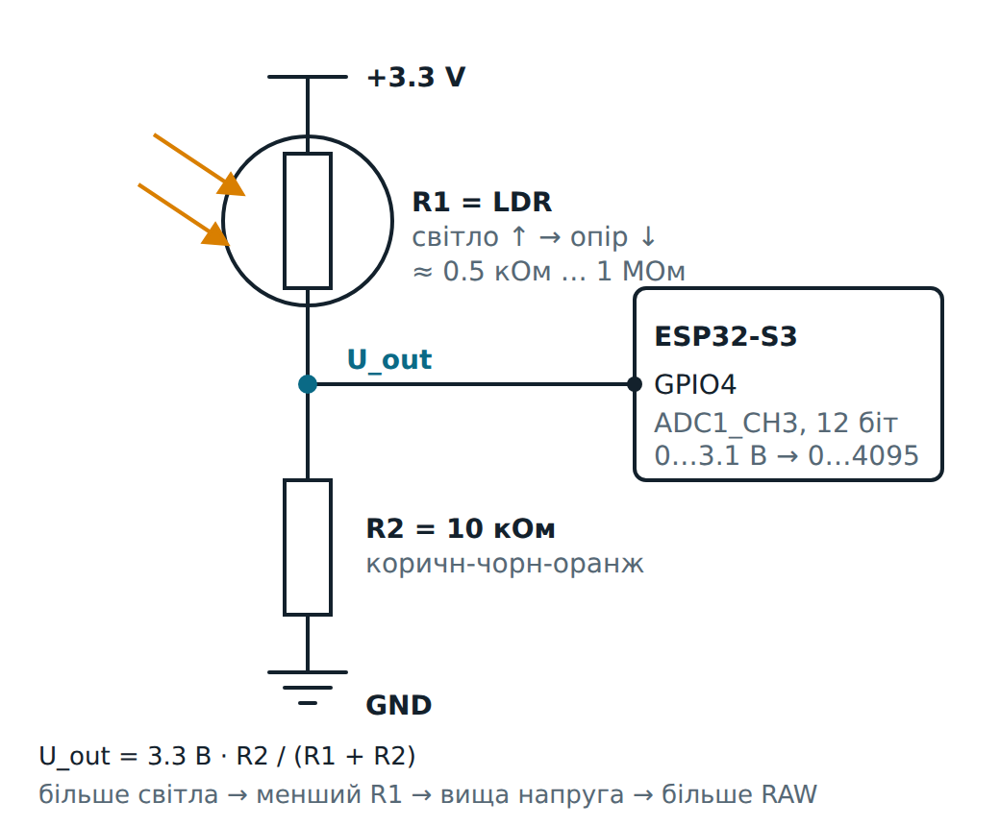

# ESP32-S3: вимірювання освітленості — фоторезистор і АЦП

Модуль 1.6, домашнє завдання. Фоторезистор (LDR) і резистор 10 кОм утворюють подільник напруги.
ESP32-S3 кожні 100 мс вимірює напругу в його середній точці двома способами і порівнює результати:

| Що                | Як отримуємо                                  | Приклад (умовний) |
|-------------------|-----------------------------------------------|-------------------|
| `RAW`             | `analogRead(4)`: «сире» число АЦП, 0…4095     | `2048`   |
| `U_calc`          | за формулою `RAW / 4095 · 3100 мВ`            | `1550.4` |
| `U_meas`          | `analogReadMilliVolts(4)`: калібровані мВ     | `1532`   |
| `error`           | `(U_calc − U_meas) / U_meas · 100 %`          | `+1.20`  |

Плата — **YD-ESP32-S3** (VCC-GND Studio, клон ESP32-S3-DevKitC-1, N16R8).

```bash
cd esp32-s3-ldr-adc
pio run -t upload          # зібрати та прошити
pio device monitor         # 115200: таблиця вимірів кожні 100 мс, підсумок раз на 10 с
```

### Інтерактивні сторінки та симуляція

| Де | Як |
|----|----|
| [**АЦП і світло**](https://grok-rs.github.io/platformio-projects/adc-light/) | теорія модуля 1.6 простими словами: аналог і цифра, квантування, подільник з LDR, які піни можна, ослаблення, шум, тест |
| [**Люксметр на ESP32-S3**](https://grok-rs.github.io/platformio-projects/ldr-lab/) | ця прошивка в анімації: макетка з платою, схема, як АЦП шукає число, код і блок-схема крок за кроком, Serial, графік, звідки похибка |
| VS Code | розширення *Wokwi Simulator*, `pio run`, далі F1 → *Wokwi: Start Simulator*. Клікніть на чип *LDR divider* — з'явиться повзунок світла |
| CLI / автотест | `wokwi-cli . --scenario wokwi/scenarios/light-levels.yaml --timeout 20000` (токен — у `../.envrc`) |

У Wokwi немає «голого» фоторезистора. Його модуль *photoresistor sensor* зібраний навпаки
(LDR до GND, живлення 5 В): там у темряві напруга *зростає*, а при 3.3 В вихід доходить до 5 В.
Тому подільник із завдання змодельовано власним чипом `wokwi/chip/ldr-divider`. Він рахує
`3V3 ── LDR ── OUT ── 10 кОм ── GND` і подає на АЦП ту напругу, яку бачив би справжній ESP32-S3.
Повзунок чипа задає `log10(лк)`: `0` = 1 лк, `2` = 100 лк, `4` = 10 000 лк.

> **Похибка в симуляторі не справжня.** У Wokwi немає калібрувальних даних eFuse, тому
> `analogReadMilliVolts()` перераховує RAW «типовим» коефіцієнтом. Похибка виходить ≈ −14…−23 %,
> а вище 3.1 В вона безглузда: 4095 → 5090 мВ. Справжню похибку свого чипа можна побачити лише на
> реальній платі. Сценарій тому перевіряє `RAW` і `U_calc`, а `U_meas` не чіпає.

---

## 1. Компоненти

| Кількість | Компонент                   | Примітка                                                     |
|-----------|-----------------------------|--------------------------------------------------------------|
| 1         | YD-ESP32-S3 (N16R8)         |                                                              |
| 1         | Фоторезистор (LDR), GL5528 або схожий | полярності немає, ніжки рівноцінні                 |
| 1         | Резистор 10 кОм             | смуги: коричнева-чорна-оранжева(-золота)                     |
| 4         | Перемички «тато-тато»       | 3V3 → «+», GND → «−», GPIO4 → ряд подільника                 |
| 1         | Макетна плата (830 точок)   |                                                              |
| 1         | USB-C кабель                | у роз'єм **USB** (не **COM**): Serial іде через нативний USB |

## 2. Схема



```
 3V3 ──[ LDR ]──┬──[ 10 кОм ]── GND
                │
              GPIO4  (ADC1_CH3)
```

`U_out = 3.3 В · R2 / (R_LDR + R2)`, `R2 = 10 кОм`:

| Освітлення              | R_LDR (≈ GL5528) | U_out    | RAW (`/3.1 В · 4095`) |
|-------------------------|------------------|----------|-----------------------|
| долоня / ніч, 0.1 лк    | ~380 кОм         | ~85 мВ   | ~113                  |
| сутінки, 10 лк          | ~15 кОм          | 1.32 В   | 1744                  |
| кімната, 100 лк         | ~3 кОм           | 2.54 В   | 3355                  |
| сонце, 100 000 лк       | ~25 Ом           | 3.29 В   | **4095** (стеля)      |

Приклад зі схеми в завданні: `R_LDR = 580.1 кОм` → `3.3 · 10 / 590.1 = 55.9 мВ`.

**Чому LDR зверху, а 10 кОм знизу.** Так більше світла дає *більшу* напругу і більше число RAW.
Якщо поміняти їх місцями, усе працюватиме, але навпаки: на світлі число падатиме.

**Чому 10 кОм.** Подільник найчутливіший, коли `R2` близький до опору LDR у потрібному діапазоні
освітлення. Для GL5528 у кімнаті це кілька–десятки кОм, тож 10 кОм — добрий вибір.

## 3. Вибір виводу

| Функція      | GPIO | Канал     | Де на платі                         |
|--------------|------|-----------|-------------------------------------|
| Вхід LDR     | 4    | ADC1_CH3  | лівий гребінець, пін 4 (напис `4`)  |

- **ADC1** (GPIO1…10) працює завжди. **ADC2** (GPIO11…20) ділить апаратуру з Wi-Fi: коли Wi-Fi
  увімкнений, читання може не вдатися (у ESP-IDF — `ESP_ERR_TIMEOUT`). Для датчиків беремо ADC1.
- Не беремо strapping-піни (0, 3, 45, 46) і USB (19, 20).
- **Ніколи не подавайте на пін понад 3.3 В.** Цей подільник живиться від 3V3, тому вище не буде.

## 4. Монтаж на макетній платі

Розкладка та сама, що в `diagram.json` (плата в рядах 1–22, антеною праворуч):

1. **GND** (ряд 1) → синя шина «−»; **3V3** (ряд 22) → червона шина «+».
2. **LDR**: одна ніжка в шину «+», друга — у ряд 30.
3. **10 кОм**: з ряду 30 у шину «−».
4. **GPIO4** (ряд 19) → перемичка в ряд 30.

Перевірка мультиметром (до прошивки): між рядом 30 і GND — від десятків мВ (закрити долонею)
до ~3 В (ліхтарик телефону).

## 5. Алгоритм

```
setup:  Serial 115200 → 12 біт, ослаблення 11 дБ на GPIO4 → банер
loop:   минуло ≥ 100 мс?  ── ні ─────────────────────────────┐
          │ так                                               │
          RAW    = analogRead(4)                              │
          U_meas = analogReadMilliVolts(4)                    │
          U_calc = RAW / 4095 · 3100                          │
          error  = (U_calc − U_meas) / U_meas · 100 %         │
          кожні 25 рядків — шапка таблиці; надрукувати рядок  │
          U_meas ≥ 100 мВ? → додати |error| до підсумку       │
        минуло ≥ 10 с? → надрукувати підсумок, обнулити ◄─────┘
```

## 6. Код

Уся програма — [`src/main.cpp`](src/main.cpp). Що в ній варто помітити:

- **Неблокуючий таймер.** `if (now - lastSampleAt >= 100) lastSampleAt += 100;`, як у модулі 1.4.
  Беззнакова різниця працює й після переповнення `millis()`. `+=` замість `= now` не дає кроку
  «повзти», якщо `loop()` трохи запізнився.
- **`3100`, а не `3300`.** На ESP32-S3 з ослабленням 11 дБ АЦП вимірює **0…3100 мВ**
  ([документація Arduino-ESP32](https://docs.espressif.com/projects/arduino-esp32/en/latest/api/adc.html#analogsetattenuation)).
  Усе вище ~3.1 В він показує як 4095. Тому `U_calc` ніколи не буває більшим за 3100.
- **`analogReadMilliVolts()`** (з великою **V**; в умові завдання помилково `Millivolts`)
  перераховує RAW з урахуванням калібрування конкретного чипа, записаного на заводі в eFuse.
  `analogRead()` дає «сирі» числа без калібрування.
- **Два окремі виміри.** `analogRead()` і `analogReadMilliVolts()` перетворюють напругу кожен
  окремо. Тому в `error` потрапляє і шум АЦП (±кілька одиниць RAW).
- **Ділення на нуль.** Якщо `U_meas = 0`, похибка не визначена: друкуємо `n/a`.
- **Похибка біля нуля.** Різниця 3 мВ при 10 мВ — це вже 30 %. Тому в підсумок потрапляють лише
  виміри від 100 мВ: він має описувати АЦП, а не ділення на «майже нуль».

Вивід (Wokwi, повзунок світла 1 → −1):

```
=== ESP32-S3: LDR light meter (module 1.6) ===
Divider: 3V3 - LDR - GPIO4 - 10k - GND (more light -> higher voltage)
ADC: 12 bit (0..4095), 11 dB, Uref = 3100 mV, every 100 ms
U_calc = RAW / 4095 * 3100 mV; error = (U_calc - U_meas) / U_meas * 100 %

  t, ms   RAW  U_calc,mV  U_meas,mV  error,%  light
-------  ----  ---------  ---------  -------  ----------------
    187  2610     1975.8       2395   -17.50  ############....
    287  1744     1320.2       1618   -18.40  ########........
    387   113       85.5        111   -22.93  #...............
...
--- summary: 100 samples >= 100 mV, |error| avg 38.26 %, max 39.10 % ---
```

`U_meas` і `error` тут із симулятора, тож ≈ −20 % (див. вище). Підсумок ще гірший, бо
більшість цих 10 с повзунок стояв на «сонці», де Wokwi дає 4095 → 5090 мВ. На реальній платі чекайте кілька
відсотків. Знак показує напрям: «−» означає, що формула з 3100 мВ занижує напругу. У рядку
`esp32-hal-adc.c … Characterized using …` (рівень логів 3) видно, яке калібрування застосувалося:
`eFuse …` на справжньому чипі, `Default Vref` у Wokwi.

## 7. Звідки береться похибка

1. **Уявний `U_ref`.** 3100 мВ — номінал. Реальна «стеля» конкретного чипа трохи інша (±кілька %).
2. **Зсув нуля.** Перші десятки мВ АЦП може показувати як 0.
3. **Нелінійність.** Біля 0 і біля 3.1 В сходинки нерівні. Калібрування в `analogReadMilliVolts()`
   це враховує, а пряма формула — ні.
4. **Шум.** Два окремі виміри дають трохи різні числа. Допомагає усереднення (модуль 5.5).

Покрутіть ці параметри в розділі «Звідки похибка» на [інтерактивному стенді](https://grok-rs.github.io/platformio-projects/ldr-lab/).

## 8. Перевірка роботи

1. Після прошивки в моніторі — банер і таблиця, рядок кожні 100 мс (`t, ms` зростає на 100).
2. Закрийте LDR долонею → `RAW` і `U_calc` падають, шкала `light` порожніє.
3. Посвітіть ліхтариком телефону → числа ростуть; дуже яскраво → `RAW 4095`, `U_calc 3100.0`.
4. Раз на 10 с — рядок `--- summary: …` із середньою і найбільшою |похибкою|.

## 9. Якщо щось не працює

| Симптом                                     | Причина / що перевірити                                             |
|---------------------------------------------|---------------------------------------------------------------------|
| Завжди `0`                                  | перемичка GPIO4 не в ряду подільника; ряд замкнутий на GND          |
| Завжди `4095`                               | ряд з'єднаний з 3V3 напряму (немає 10 кОм до GND); дуже яскраве світло |
| Числа скачуть без зміни світла              | погано сидить ніжка в макетці; вхід «висить» (обрив до 10 кОм)       |
| На світлі число **падає**                   | LDR і 10 кОм переплутані місцями (LDR має бути з боку 3V3)          |
| На ADC2-піні з Wi-Fi помилки/нулі           | беріть ADC1: GPIO1…10                                                |
| Порт не з'являється / монітор порожній      | кабель у роз'єм **COM** або кабель лише для зарядки; перемкнути в **USB** |

## 10. Контрольні питання

1. Скільки значень дає 12-бітний АЦП і чому максимум — 4095, а не 4096?
2. LDR = 5 кОм, R2 = 10 кОм, 3.3 В. Яка напруга на GPIO4 і яке буде RAW?
3. Чому для ESP32-S3 в формулі 3100 мВ, а не 3300 мВ?
4. Чим `analogRead()` відрізняється від `analogReadMilliVolts()`?
5. Чому відносна похибка «вибухає» біля 0 мВ?
6. Чому для датчиків з Wi-Fi беремо ADC1, а не ADC2?
7. Що зміниться, якщо поміняти місцями LDR і 10 кОм?

## Структура

```
platformio.ini        плата YD-ESP32-S3 N16R8 (як esp32-s3-devkitc-1), USB CDC для Serial
src/main.cpp          уся програма
diagram.json          схема Wokwi (макетка), wokwi.toml — прошивка з .pio/build і чип LDR
wokwi/
  gen_diagram.py      генератор diagram.json;  breadboard.py — геометрія макетки та плати
  chip/               чип «LDR + 10 кОм» для Wokwi: .c, .chip.json і зібраний .chip.wasm
                      (перезібрати: wokwi-cli chip compile wokwi/chip/ldr-divider.chip.c
                                    -o wokwi/chip/ldr-divider.chip.wasm)
  scenarios/          автотест wokwi-cli
docs/schematic.svg/png  принципова схема
```
