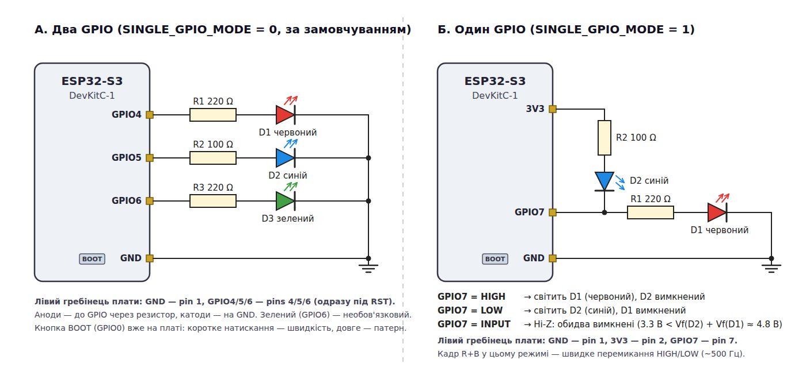
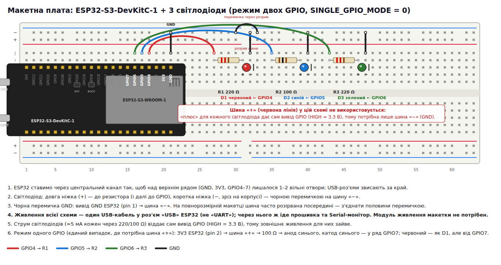
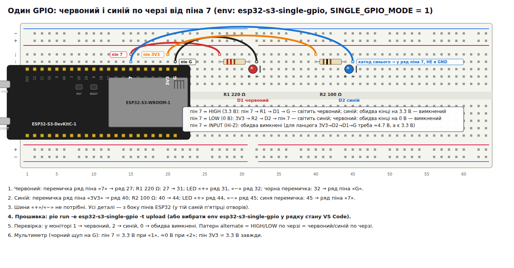

# ESP32-S3 — почергове миготіння світлодіодів

Лабораторна робота на ESP32-S3-DevKitC-1: червоний і синій світлодіоди блимають по черзі.
Обов'язкова частина — два GPIO; додатково реалізовано складніші патерни, третій світлодіод,
зміну швидкості та режим, у якому обидва світлодіоди керуються **одним** GPIO.



## Швидкий старт

```bash
pio run -t upload          # режим двох GPIO (за замовчуванням)
pio device monitor         # 115200; плата скидається при підключенні, банер видно завжди
```

| Середовище             | Схема                                      | Команда                                     |
|------------------------|--------------------------------------------|---------------------------------------------|
| `esp32-s3-devkitc-1`   | GPIO4 червоний, GPIO5 синій, GPIO6 зелений | `pio run -t upload`                         |
| `esp32-s3-single-gpio` | обидва світлодіоди на GPIO7                | `pio run -e esp32-s3-single-gpio -t upload` |

## Монтаж

Кожен світлодіод: `GPIO → резистор → анод (довга ніжка) → катод → GND`.
Червоний і зелений — 220 Ω, синій — 100 Ω (у синього вище пряме падіння, з 220 Ω він тьмяний).
Живлення всієї схеми — USB-кабель ESP32 (роз'єм **USB**, не UART); шини живлення макетки не потрібні.



### Один GPIO

Червоний між GPIO7 і GND, синій між 3V3 і GPIO7 — світлодіоди «дивляться» у різні боки
відносно виводу. `HIGH` → світить червоний, `LOW` → синій (вивід втягує струм), `INPUT` (Hi-Z) →
обидва вимкнені, бо двом світлодіодам послідовно треба ≈4.8 В, а є лише 3.3 В.



## Керування

| Дія                       | Результат                                               |
|---------------------------|---------------------------------------------------------|
| BOOT — коротке натискання | наступна швидкість (1000 → 500 → 250 → 120 мс)          |
| BOOT — довге (> 0.6 с)    | наступний патерн                                        |
| Serial `1` / `2` / `3`    | тримати червоний / синій / зелений (перевірка монтажу)  |
| Serial `0`                | усі вимкнути                                            |
| Serial `p` / `v`          | наступний патерн / швидкість                            |
| Serial інша клавіша       | повернутися до автоматичного миготіння                  |

Патерни: `alternate` (базова вимога), `alternate_gap`, `police`, `three_leds`, `chase`, `mix`.
Після скидання виконується самотест — кожен світлодіод по черзі на 0.4 с.

## Якщо не світиться

1. У моніторі набрати `1` — червоний має горіти постійно.
2. Мультиметр, чорний щуп на пін **G** ESP32 (біля антени): пін `4` = 3.3 В, довга ніжка LED ≈ 1.9 В, коротка = 0 В.
   - 3.3 В на довгій ніжці → світлодіод перевернутий;
   - від'ємна напруга → чорний щуп не на GND (найчастіше на 5V з іншого кінця гребінця);
   - 0 В на піні → плата не вставлена в макетку до кінця.
3. Мінімальна схема для перевірки — `docs/breadboard_step1.png`: один світлодіод, без шин живлення.

## Структура коду

```
include/
  config.hpp                 усі піни та часові константи
  frame.hpp                  Led (один світлодіод) та Frame (набір увімкнених LED)
  pattern.hpp                Pattern + доступ до таблиць патернів і швидкостей
  span.hpp                   мінімальний std::span для незмінних масивів
  led_driver.hpp             інтерфейс LedDriver — єдиний шар, що знає про схему
  gpio_led_driver.hpp        реалізація: окремий вивід на кожен LED
  shared_pin_led_driver.hpp  реалізація: обидва LED на одному виводі (HIGH/LOW/Hi-Z)
  blink_player.hpp           неблокуючий програвач патернів (без delay())
  button.hpp                 кнопка з антидребезгом, коротке/довге натискання
  serial_console.hpp         команди та стан через Serial-монітор
src/
  main.cpp                   збирання компонентів, setup()/loop()
  patterns.cpp               таблиці кадрів і пресети швидкості
docs/
  *.png, *.svg               схема та розкладки на макетці
  tools/                     генератори діаграм (python3 + headless Chrome): tools/render.sh
```

Вибір схеми підключення — єдине місце з умовною компіляцією (`SINGLE_GPIO_MODE` у `main.cpp`);
решта коду працює з абстрактним `LedDriver` і не знає, скільки виводів задіяно.
