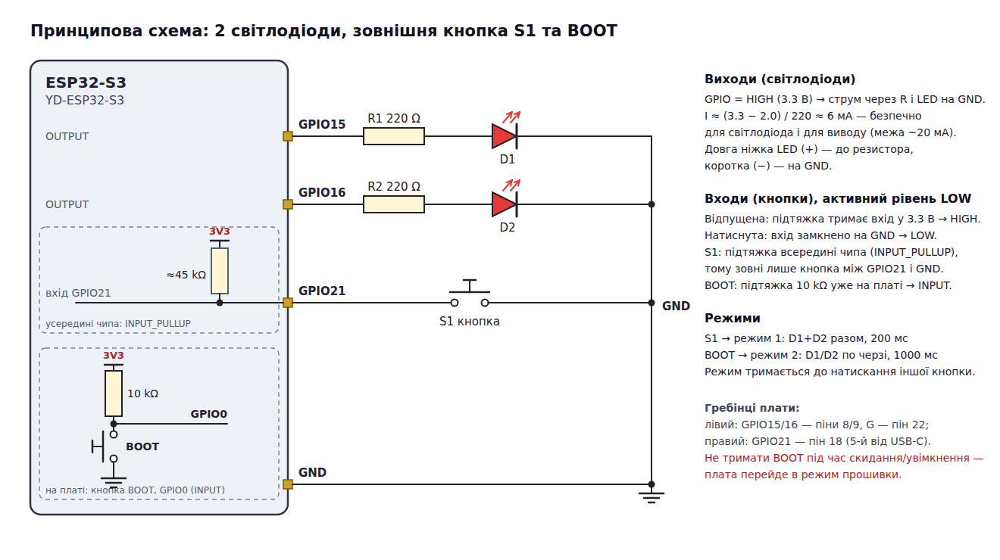
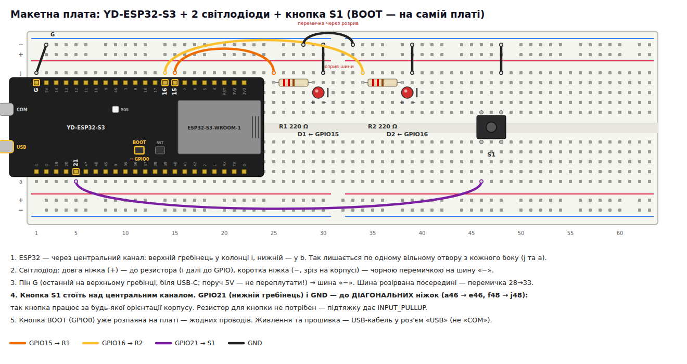

# ESP32-S3: два світлодіоди, зовнішня кнопка та BOOT

Модуль 1.4, домашнє завдання. Два світлодіоди працюють в одному з двох режимів,
а режим вибирають дві кнопки: зовнішня (S1) і розпаяна на платі BOOT.

Плата — **YD-ESP32-S3** (VCC-GND Studio, клон ESP32-S3-DevKitC-1, N16R8).

| Кнопка                      | Режим                          | Ефект                                    |
|-----------------------------|--------------------------------|------------------------------------------|
| S1 (зовнішня, GPIO21)       | **1: швидкий / синхронний** (стартовий) | обидва LED разом: 200 мс світять, 200 мс ні |
| BOOT (на платі, GPIO0)      | **2: повільний / по черзі**    | «залізничний переїзд»: 1000 мс D1, 1000 мс D2 |

Вибраний режим зберігається, доки не натиснути **іншу** кнопку. Повторне натискання тієї самої
кнопки нічого не змінює.

```bash
cd esp32-s3-two-buttons
pio run -t upload          # зібрати та прошити
pio device monitor         # 115200: банер і повідомлення «Mode -> …» при кожній зміні режиму
```

---

## 1. Компоненти

| Кількість | Компонент                     | Примітка                                                      |
|-----------|-------------------------------|---------------------------------------------------------------|
| 1         | YD-ESP32-S3 (N16R8)           | клон ESP32-S3-DevKitC-1; кнопка BOOT уже є на платі           |
| 2         | Світлодіод 5 мм               | бажано однакового кольору, напр. два червоні                  |
| 2         | Резистор 220 Ω                | смуги: червона-червона-коричнева(-золота)                     |
| 1         | Тактова кнопка 6×6 мм         | 4 ніжки                                                       |
| ~7        | Перемички «тато-тато»         |                                                               |
| 1         | Макетна плата (830 точок)     |                                                               |
| 1         | USB-C кабель                  | у роз'єм **USB** — правий, якщо плата антеною вгору (не **COM**) |

## 2. Вибір виводів

| Функція          | GPIO | Де на платі                              | Режим виводу     |
|------------------|------|------------------------------------------|------------------|
| Світлодіод D1    | 15   | лівий гребінець, пін 8 (напис `15`)      | `OUTPUT`         |
| Світлодіод D2    | 16   | лівий гребінець, пін 9 (напис `16`)      | `OUTPUT`         |
| Зовнішня кнопка  | 21   | правий гребінець, пін 18 (напис `21`)    | `INPUT_PULLUP`   |
| Кнопка BOOT      | 0    | кнопка на платі (правий гребінець, пін 14) | `INPUT`        |
| Земля            | GND  | лівий гребінець, пін 22 (напис `G`)      | —                |

Піни — як у завданні. Нумерація — від антени (плата антеною вгору, USB-C унизу):

```
лівий гребінець:  3V3 3V3 RST 4 5 6 7 [15] [16] 17 18 8 3 46 9 10 11 12 13 14 5V [G]
правий гребінець: G TX RX 1 2 42 41 40 39 38 37 36 35 0 45 48 47 [21] 20 19 G G
```

**Увага:** `G` на лівому гребінці стоїть поруч із `5V` — не переплутайте, інакше 5 В піде на
шину «−».

Уникаємо виводів зі спеціальним призначенням: strapping-піни (0, 3, 45, 46 — задають режим
завантаження), USB (19, 20), флеш і PSRAM (26…37 на модулі N16R8). GPIO0 — виняток: це і є кнопка
BOOT, тому її використовуємо свідомо, лише як вхід.

## 3. Принципова схема



### 3.1. Світлодіоди — виходи (`OUTPUT`)

Коли вивід у режимі `OUTPUT` і `digitalWrite(pin, HIGH)`, на ньому 3.3 В; струм іде
`GPIO → резистор → анод LED → катод → GND`, і світлодіод світить. `LOW` — 0 В, струму немає.

**Навіщо резистор.** Світлодіод — не лампа: після напруги відкривання (~2 В у червоного) його
опір майже зникає, і без обмеження струм був би десятки-сотні мА — вигорить і LED, і вивід
мікроконтролера. Резистор задає струм за законом Ома:

```
I = (U_живл − U_LED) / R = (3.3 В − 2.0 В) / 220 Ω ≈ 6 мА
```

6 мА — достатньо для яскравого світіння й далеко від межі виводу ESP32-S3 (рекомендовано ≤ 20 мА).
Для синього/білого LED (U_LED ≈ 3.0 В) через 220 Ω піде лише ≈ 1.4 мА — світитиме тьмяно, тому
для цього завдання краще червоні, жовті чи зелені.

**Полярність.** Довга ніжка — анод (+), до резистора; коротка ніжка і зріз на корпусі — катод (−),
до GND. Резистор можна ставити з будь-якого боку світлодіода — важливо лише, щоб він був
послідовно.

### 3.2. Кнопки — входи, активний рівень LOW

Вхід цифрового виводу лише «дивиться», яка на ньому напруга: близько 3.3 В → `HIGH`,
близько 0 В → `LOW`. Кнопка замикає вивід на GND, отже натиснута кнопка дає `LOW`.

**Проблема «висячого» входу.** Коли кнопка відпущена, вивід ні до чого не під'єднаний. Такий вхід
має дуже великий опір і ловить наводки (від руки, сусідніх дротів, мережі 50 Гц) — `digitalRead()`
повертатиме випадкові `HIGH`/`LOW`, і режим «сам» перемикатиметься.

**Рішення — підтягувальний резистор (pull-up)** між виводом і 3.3 В:

- кнопка відпущена → через резистор на вході 3.3 В → стабільний `HIGH`;
- кнопка натиснута → вхід напряму з'єднаний з GND, резистор лише обмежує струм
  (3.3 В / 45 кОм ≈ 0.07 мА) → стабільний `LOW`.

Звідси й назва «активний LOW»: подія (натискання) відповідає низькому рівню, тому в коді
`pressed = digitalRead(pin) == LOW`.

| Кнопка | Де підтяжка                                        | Режим у коді    |
|--------|----------------------------------------------------|-----------------|
| S1     | **усередині чипа**, ≈45 кОм, вмикається програмно  | `INPUT_PULLUP`  |
| BOOT   | **на платі**, резистор 10 кОм (вже розпаяний)      | `INPUT`         |

`INPUT_PULLUP` економить зовнішній резистор: на макетці для S1 потрібна лише сама кнопка між
GPIO21 і GND. Для BOOT підтяжка вже є, тому досить `INPUT` (`INPUT_PULLUP` теж спрацював би —
дві підтяжки паралельно не шкодять, але вимога завдання — `INPUT`).

**Особливість BOOT (GPIO0).** Це strapping-пін: чип читає його в момент увімкнення/скидання.
Якщо в цей момент тримати BOOT — ESP32 стартує в режимі прошивки, а не нашої програми.
Після старту GPIO0 — звичайний вхід, і BOOT можна натискати скільки завгодно.

## 4. Монтаж на макетній платі



1. Вставити ESP32-S3 у макетку через центральний канал: верхній гребінець — у колонку `i`,
   нижній — у `b`. Тоді з кожного боку лишається по одному вільному отвору (`j` зверху, `a` знизу).
   USB-роз'єми звисають за край.

   > **Чому не `h`/`a`, як зазвичай.** Плата широка: якщо поставити гребінці в `h` та `a`, над
   > верхнім буде два вільні отвори, а під нижнім — жодного, і до GPIO21 не під'єднатися. Зсув на
   > один отвір відкриває доступ до обох гребінців.
2. **GND:** перемичка від піна `G` (останній пін верхнього гребінця, біля USB-C) у шину «−». Шина на повнорозмірній макетці
   розірвана посередині (ряди 31/32) — з'єднати половини перемичкою.
3. **D1:** GPIO15 → ряд 25; резистор R1 220 Ω — ряди 25…29; довга ніжка D1 — ряд 29, коротка — ряд 30;
   ряд 30 → шина «−».
4. **D2:** так само: GPIO16 → ряд 34; R2 — ряди 34…38; D2 — ряди 38/39; ряд 39 → шина «−».
5. **S1:** кнопку поставити над центральним каналом (ніжки в `f`/`e`, ряди 46 та 48).
   Отвір `a` у ряду GPIO21 → `a46` (нижня половина); `j48` (верхня половина) → шина «−».
   GPIO21 — 5-й пін нижнього гребінця від кінця з USB-C (на рисунку — ряд 5).

   > **Чому діагональні ніжки.** У тактовій кнопці 4 ніжки, але контакти лише два: ніжки
   > попарно з'єднані всередині. Якщо взяти дві ніжки, з'єднані постійно, кнопка буде «завжди
   > натиснута». Діагонально протилежні ніжки ніколи не належать до однієї пари, тож схема працює
   > за будь-якого повороту корпусу.
6. BOOT нічого не потребує. Живлення, прошивка та Serial-монітор — один USB-кабель.

**Перевірка перед увімкненням:** жоден провід не з'єднує 3V3/5V з GND; кожен світлодіод має свій
резистор; довгі ніжки LED — з боку GPIO.

## 5. Алгоритм

```
setup():
    LED1, LED2 → OUTPUT, обидва вимкнені
    S1   → INPUT_PULLUP
    BOOT → INPUT
    mode = 1                       ← стан за замовчуванням

loop():                            ← повторюється нескінченно
    опитати кнопки:
        S1 натиснута   → mode = 1
        BOOT натиснута → mode = 2
        жодна          → mode не змінюється   ← «фіксація стану»
    якщо mode == 1:  обидва ON → 200 мс → обидва OFF → 200 мс
    якщо mode == 2:  D1 ON, D2 OFF → 1000 мс → D1 OFF, D2 ON → 1000 мс
```

«Пам'ять» режиму — це глобальна змінна `mode`. Вона змінюється **лише** тоді, коли натиснута одна
з кнопок; у решту часу її значення зберігається між проходами `loop()`, тому вибраний режим
триває, доки не натиснути іншу кнопку. Після скидання/вимкнення живлення змінна знову
ініціалізується значенням режиму 1 — так і вимагає завдання.

## 6. Код

Весь код — у [`src/main.cpp`](src/main.cpp). Ключові частини:

**Налаштування виводів** (`setup()`):

```cpp
pinMode(kLed1Pin, OUTPUT);
pinMode(kLed2Pin, OUTPUT);
pinMode(kExtButtonPin, INPUT_PULLUP);   // внутрішній резистор ~45 кОм до 3.3 В
pinMode(kBootButtonPin, INPUT);         // підтяжка вже є на платі
```

**Опитування кнопок** — `pollButtons()`: читає обидва входи й записує в `mode` бажаний режим.
Якщо натиснуті обидві кнопки одночасно, перемагає зовнішня (перевіряється першою).
При кожній зміні режиму в Serial-монітор виводиться `Mode -> 1 (sync, 200 ms)` /
`Mode -> 2 (alternate, 1000 ms)`.

**Миготіння** — `blinkSync()` і `blinkAlternate()` виконують один повний цикл свого режиму.
`loop()` просто викликає потрібну функцію відповідно до `mode`.

### 6.1. Чому не «голий» `delay()`

Найпростіший варіант, який напрошується:

```cpp
void loop() {
  if (digitalRead(kExtButtonPin) == LOW)  mode = 1;
  if (digitalRead(kBootButtonPin) == LOW) mode = 2;

  if (mode == 1) {
    digitalWrite(kLed1Pin, HIGH); digitalWrite(kLed2Pin, HIGH); delay(200);
    digitalWrite(kLed1Pin, LOW);  digitalWrite(kLed2Pin, LOW);  delay(200);
  } else {
    digitalWrite(kLed1Pin, HIGH); digitalWrite(kLed2Pin, LOW);  delay(1000);
    digitalWrite(kLed1Pin, LOW);  digitalWrite(kLed2Pin, HIGH); delay(1000);
  }
}
```

Він працює, але `delay()` **блокує** програму: поки йде `delay(1000)`, кнопки ніхто не читає.
У режимі 2 кнопки перевіряються раз на 2 секунди, тому коротке натискання S1 просто
«губиться» — кнопку доводиться тримати до 2 с.

Тому в проєкті затримка зроблена функцією `waitMs(ms)`: вона чекає ті самі 200 / 1000 мс,
але всередині кожну мілісекунду викликає `pollButtons()`. Якщо режим змінився — очікування
перерветься, і новий режим почнеться миттєво:

```cpp
bool waitMs(uint32_t ms) {
  const uint32_t start = millis();
  while (millis() - start < ms) {
    if (pollButtons()) return false;   // режим змінився — перервати цикл миготіння
    delay(1);
  }
  return true;
}
```

`millis() - start` — беззнакова різниця, тому вона коректна навіть після переповнення `millis()`
(≈ через 49 діб роботи).

### 6.2. Чому тут не потрібен антидребезг

Механічні контакти при замиканні кілька мілісекунд «дребезжать» — `digitalRead()` бачить
серію `LOW/HIGH/LOW…`. Якби кнопка **перемикала** режим (1 → 2 → 1), кожен «відскок»
рахувався б як окреме натискання. Тут же кожна кнопка **встановлює** конкретний режим:
десять разів записати `mode = 1` — те саме, що записати його один раз. Операція ідемпотентна,
і дребезг ні на що не впливає.

## 7. Перевірка роботи

1. Після прошивки обидва LED миготять **синхронно й швидко** (режим 1), у моніторі —
   `Start mode: 1 (sync, 200 ms)`.
2. Коротко натиснути **BOOT** → LED блимають **по черзі й повільно**; у моніторі
   `Mode -> 2 (alternate, 1000 ms)`. Відпустити кнопку — режим 2 лишається.
3. Ще раз натиснути BOOT → нічого не змінюється.
4. Натиснути **S1** → знову швидкий синхронний режим, `Mode -> 1 (sync, 200 ms)`.
5. Натиснути RST (скидання) → програма стартує в режимі 1.

## 8. Якщо щось не працює

| Симптом                                              | Причина / що перевірити                                                    |
|------------------------------------------------------|-----------------------------------------------------------------------------|
| Світлодіод не світить у жодному режимі               | перевернутий LED (довга ніжка має бути з боку резистора); немає GND на шині (розрив посередині) |
| Постійно режим 1, BOOT «не працює»                   | S1 підключена до ніжок, з'єднаних постійно, — взяти діагональні ніжки       |
| S1 не реагує                                         | дріт не в тому ряду, що GPIO21 (напис `21`, між `47` і `20`); плата стоїть у `h`/`a` і нижній гребінець закритий |
| Режим перемикається сам                              | вхід «висить»: для S1 має бути `INPUT_PULLUP`, провід — у правильному ряду |
| Після натискання RST програма не стартує             | під час скидання була натиснута BOOT — плата в режимі прошивки; натиснути RST ще раз, не тримаючи BOOT |
| Порт не з'являється / монітор порожній               | кабель у роз'єм **COM** (Serial іде через нативний USB) або кабель лише для зарядки; перемкнути в роз'єм **USB** |

## 9. Контрольні питання

1. Чим відрізняються режими `INPUT`, `INPUT_PULLUP` і `OUTPUT`?
2. Що буде на вході без підтяжки, коли кнопка відпущена, і чому це погано?
3. Чому для S1 використано `INPUT_PULLUP`, а для BOOT — `INPUT`?
4. Чому натиснута кнопка читається як `LOW`?
5. Розрахуйте струм світлодіода з резистором 220 Ω при U_LED = 2.0 В.
6. Чому GPIO0 не можна тримати натиснутим під час увімкнення плати?

## Структура

```
platformio.ini        плата YD-ESP32-S3 N16R8 (як esp32-s3-devkitc-1), USB CDC для Serial
src/main.cpp          уся програма
docs/
  schematic.png/svg   принципова схема
  breadboard.png/svg  розкладка на макетній платі
  tools/              генератори діаграм (python3 + headless Chrome): tools/render.sh;
                      yd_board.py — спільне малювання макетки та плати YD-ESP32-S3
```
